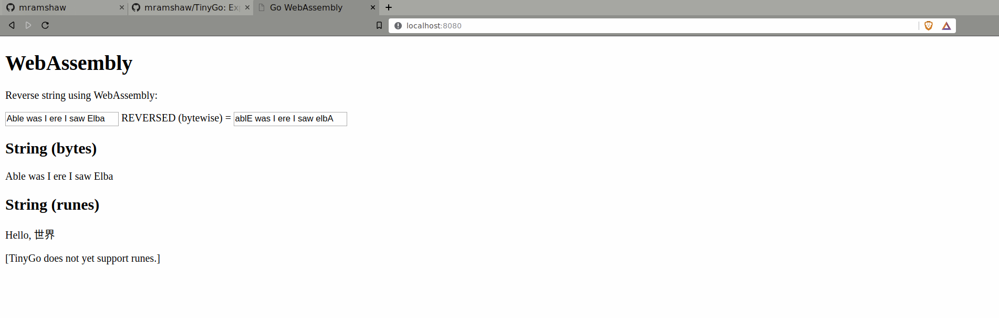

# TinyGo


As a longtime [Golang](http://github.com/mramshaw/Golang) fan, I have cross-compiled
Go programs against [MUSL](#musl) and experimented with
[MQTT](https://github.com/mramshaw/MQTT_and_mosquitto)
(an IoT protocol for sensors and devices such as the Arduino or Raspberry Pi).
I have also experimented with the
[Raspberry Pi](https://github.com/mramshaw/Speech-Recognition#raspberry-pi)
(a single-board microcomputer) so TinyGo sounded like it was worth a look.

## Contents

The contents are as follows:

* [What is TinyGo?](#what-is-tinygo)
* [Prerequisites](#prerequisites)
* [Installation](#installation)
* [Building](#building)
* [Options](#options)
* [Targets](#targets)
    * [ARM](#arm)
    * [AVR](#avr)
* [Running](#running)
    * [Compile WASM](#compile-wasm)
    * [Run webserver](#run-webserver)
    * [Open browser](#open-browser)
* [Reference](#reference)
    * [TinyGo references](#tinygo-references)
    * [LLVM](#llvm)
    * [MUSL](#musl)
    * [WebAssembly](#webassembly)
* [Alternatives](#alternatives)
* [Credits](#credits)
* [To Do](#to-do)

## What is TinyGo?

> TinyGo is a Go compiler intended for use in small places such as microcontrollers,
> WebAssembly (WASM), and command-line tools.

And:

> TinyGo is a project to bring Go to microcontrollers and small systems with a single processor core.

Both of the above quotes are from:

    http://github.com/tinygo-org/tinygo

TinyGo was originally started by Ayke van Laëthem, who was a contributor to [MicroPython](http://github.com/micropython/micropython/)
(a version of Python that runs on microcontrollers) and other projects in the embedded space.

## Prerequisites

Requires __Go v1.11__ or greater.

Verify as follows:

```bash
$ go version
go version go1.11 linux/amd64
$
```

Requires libstdc++6 __3.4.22__ or greater. Verify this as follows:

```bash
$ strings /usr/lib/x86_64-linux-gnu/libstdc++.so.6 | grep GLIBCXX
```

If `GLIBCXX_3.4.22` is not listed, then libstdc++6 must be installed or upgraded.

On Ubuntu, this can be done as follows:

```bash
$ sudo add-apt-repository ppa:ubuntu-toolchain-r/test
...
$ sudo apt-get update
...
$ sudo apt-get upgrade libstdc++6
...
$
```

## Installation

As per the instructions, download and install as follows:

```bash
$ wget https://github.com/tinygo-org/tinygo/releases/download/v0.5.0/tinygo_0.5.0_amd64.deb
...
$ sudo dpkg -i tinygo_0.5.0_amd64.deb
...
$
```

Note that the version number is subject to change. Check for the latest release here:

    http://github.com/tinygo-org/tinygo/releases

Verify the installation as follows:

```bash
$ /usr/local/tinygo/bin/tinygo version
tinygo version 0.5.0 linux/amd64
$
```

[By default TinyGo is installed in __/usr/local/tinygo/__ with __root__ permissions but globally executable.]

## Building

Building TinyGo is straightforward, but on Ubuntu will require __cmake__ & __cmake-data__ as well as __ninja-build__.

## Options

Find out more about TinyGo and its capabilities as follows:

```bash
$ /usr/local/tinygo/bin/tinygo help
TinyGo is a Go compiler for small places.
version: 0.5.0
usage: /usr/local/tinygo/bin/tinygo command [-printir] [-target=<target>] -o <output> <input>

commands:
  build: compile packages and dependencies
  run:   compile and run immediately
  flash: compile and flash to the device
  gdb:   run/flash and immediately enter GDB
  clean: empty cache directory (/home/owner/.cache/tinygo)
  help:  print this help text

flags:
  -cflags string
        additional cflags for compiler
  -dumpssa
        dump internal Go SSA
  -gc string
        garbage collector to use (none, dumb, marksweep)
  -ldflags string
        additional ldflags for linker
  -no-debug
        disable DWARF debug symbol generation
  -o string
        output filename
  -ocd-output
        print OCD daemon output during debug
  -opt string
        optimization level: 0, 1, 2, s, z (default "z")
  -port string
        flash port (default "/dev/ttyACM0")
  -printir
        print LLVM IR
  -size string
        print sizes (none, short, full)
  -target string
        LLVM target
  -wasm-abi string
        WebAssembly ABI conventions: js (no i64 params) or generic (default "js")
$
```

## Targets

Straight out of the box, TinyGo can be used to compile to [WebAssembly](#webassembly).

For hardware platforms such as ARM or AVR there are additional requirements.

The full list of supported boards is provided here:

    http://github.com/tinygo-org/tinygo#supported-boardstargets

#### ARM

ARM processors are apparently well supported.

From:

    https://tinygo.org/compiler-internals/microcontrollers/

> ARM Cortex-M processors are well supported.

ARM devices apparently require __clang-8__.

#### AVR

Arduino (AVR) devices apparently require __gcc-avr__, __avr-libc__ and __avrdude__.

## Running

We will try it out for WASM as follows:

#### Compile WASM

Compile our Golang code to WASM as follows:

```bash
$ cd src
$ /usr/local/tinygo/bin/tinygo build -o ./wasm.wasm -target wasm ./wasm.go
$
```

#### Run webserver

Launch a web server to serve up our WASM-enriched HTML:

```bash
$ cd ..
$ go run server.go
2019/05/18 16:42:41 Serving './src' on http://localhost:8080
^Csignal: interrupt
$
```

This is important as our WASM needs to be properly MIME-encoded.

As usual, <kbd>Ctrl-C</kbd> to terminate once testing is complete.

#### Open browser

Open a javascript-enabled browser to the following URL:

    http://localhost:8080/

And test. The results should look as follows:



## Reference

Some useful references are listed below.

#### TinyGo references

The TinyGo repo can be found here:

    http://github.com/tinygo-org/tinygo

Getting started with TinyGo:

    http://tinygo.org/getting-started/linux/

How much of Go is implemented in TinyGo:

    http://tinygo.org/lang-support/

[Personal testing also indicates that __runes__ are not yet fully supported in TinyGo.]

#### LLVM

LLVM is designed for compile-time, link-time, run-time, and "idle-time" optimization of programs written
in arbitrary programming languages (among them are Kotlin, Lua, Rust and Swift). Despite its name, it has
nothing to do with virtual machines.

TinyGo takes the Golang [SSA](http://en.wikipedia.org/wiki/Static_single_assignment_form) and passes it
to the LLVM toolchain. For more details the following article is worth a look:

    http://aykevl.nl/2019/04/llvm-from-go

Probably the definitive site for learning about LLVM:

    http://llvm.org/

#### MUSL

Probably the definitive site for learning about MUSL:

    http://www.musl-libc.org/

MUSL is used as the standard C library by the Alpine Linux distribution.

According to Wikipedia:

> Musl was designed from scratch to allow efficient static linking and to have realtime-quality robustness
> by avoiding races, internal failures on resource exhaustion and various other bad worst-case behaviors
> present in existing implementations

And:

>It also implements most of the widely used non-standard Linux, BSD, and glibc functions.

Both of the above quotes are from:

    http://en.wikipedia.org/wiki/Musl

The second quote is particularly important; MUSL only implements ***most*** of the standard
glibc functions, which means it cannot be simply used as a drop-in replacement for glibc.

Nevertheless, if used carefully it can be used as a replacement for ***most*** uses.

For more information, please refer to the following link:

    http://wiki.musl-libc.org/compatibility.html

#### WebAssembly

For those familiar with [Java applet](http://en.wikipedia.org/wiki/Java_applet) fundamentals,
WebAssembly looks very much like the portable [Java bytecode](http://en.wikipedia.org/wiki/Java_bytecode)
that enabled Java applets to run in Java-enabled browsers.

> WebAssembly (abbreviated Wasm) is a binary instruction format for a stack-based virtual machine.
> Wasm is designed as a portable target for compilation of high-level languages like C/C++/Rust,
> enabling deployment on the web for client and server applications.

    http://webassembly.org

WebAssembly seems to be primarily associated with Rust but has been a topic of interest in the
Golang community for some time. For instance:

    http://changelog.com/gotime/bonus-77

[At various Go meetups I have attended, WASM has been discussed.]

## Alternatives

As usual, there are alternative solutions - some of which are listed below.

#### EMBD

EMBD supports the Raspberry Pi, BeagleBone Black, and CHIP. There are (possibly) other options.

EMBD is sponsored by [Thoughtworks](http://www.thoughtworks.com/).

[It appears to be defunct, but is probably still worth a look.]

Home page:

    http://embd.kidoman.io/

Source code (Last updated 7 May 2017):

    http://github.com/kidoman/embd

Go Doc:

    http://godoc.org/github.com/kidoman/embd

## Credits

Inspired by this podcast:

    http://changelog.com/gotime/84

## To Do

- [x] Add Alternatives
- [x] Add notes on compiling TinyGo
- [x] Add string reversal code
- [ ] More testing
